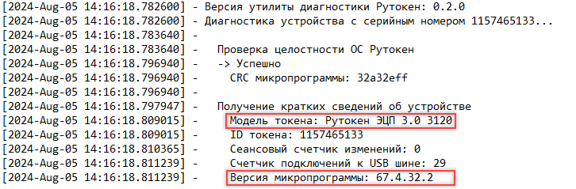

== Приложение 1. Список проверок на устройствах с разными микропрограммами

Лог-файл содержит краткие сведения об устройстве, включая модель
устройства и версию микропрограммы.  Предпоследнее число в этой версии
необходимо для поиска проверки, актуальной для устройства с определенной
микропрограммой.

Пример

В лог-файле диагностики видно, что модель Рутокена — *Рутокен ЭЦП 3.0
3120*, а версия микропрограммы — *67.4.[.underline]#32#.2*.

Чтобы понять, какие проверки актуальны для этого устройства и этой
версии микропрограммы, смотрим на _Таблицу 3_ и столбец _МП_ _32_.

.Таблица 1. Проверки для устройства Рутокен Lite
[%collapsible]
====
[cols=",,,^,",]
|===
|№ |Проверка |МП 7-9 |МП 30 |МП 32
|1 |Проверка целостности ОС Рутокен |+ |+ |+
|2 |Проверка целостности КИ | + | + | +
|2.1 |Проверка системной ключевой информации |- |+ |+
|2.2 |Проверка Глобальных PIN-кодов |+ |+ |+
|3 |Получение статуса секторов памяти |- a|
+ (не для всех
микроконтроллеров)

|+
|4 |Проверка работоспособности ГСЧ |+ |+ |+
|5.  a|
Проверка поддержки журнала СБ

|+ |+ |+
|===
====

.Таблица 2. Проверки для устройства Рутокен ЭЦП 2.0
[%collapsible]
====
[cols=",,,,,",]
|===
|№ |Проверка |МП 23 |МП 24 |МП 26 |МП 27
|1 |Проверка целостности ОС Рутокен |+ |+ |+ |+
|2 |Проверка работы криптоалгоритмов |+ |+ |+ |+
|2.1 |Тестирование алгоритма ГОСТ 28147-89 |+ |+ |+ |+
|2.2 |Тестирование алгоритма ГОСТ 34.10-2001 |+ |+ |+ |+
|2.3 |Тестирование алгоритма ГОСТ 34.11-1994 |+ |+ |+ |+
|2.4 |Тестирование алгоритма ВКО 2001 |+ |+ |+ |+
|2.5 |Тестирование алгоритма ГОСТ 34.10-2012 |+ |+ |+ |+
|2.6 |Тестирование алгоритма ГОСТ 34.11-2012 |+ |+ |+ |+
|2.7 |Тестирование алгоритма ВКО 2012 |+ |+ |+ |+
|3 |Проверка целостности КИ | + | + | + | +
|3.1 |Проверка системной ключевой информации |+ |+ |+ |+
|3.2 |Проверка Глобальных PIN-кодов |+ |+ |+ |+
|3.3 |Проверка RSF файлов |+ |+ |+ |+
|4 |Получение журнала ошибочных операций | + | + | + | +
|4.1 |Количество ошибок ввода глобальных PIN-кодов |+ |+ |+ |+
|4.2 |Количество ошибок работы ГСЧ |+ |+ |+ |+
|4.3 |Количество ошибок работы алгоритма VKO |+ |+ |+ |+
|4.4 |Количество ошибок работы алгоритмов ГОСТ 34.10 |+ |+ |+ |+
|4.5 |Количество ошибок работы алгоритмов ГОСТ 28147 |+ |+ |+ |+
|5 |Получение статуса секторов памяти |- |- |- |+
|6 |Проверка работоспособности ГСЧ |+ |+ |+ |+
|7 |Проверка поддержки журнала СБ |+ |+ |+ |+
|===
====

.Таблица 3. Проверки для устройства Рутокен ЭЦП 3.0
[%collapsible]
====
[cols=",,,",]
|===
|№ |Проверка |МП 28-30 |МП 32
|1 |Проверка целостности ОС Рутокен |+ |+
|2 |Получение кратких сведений об устройстве |+ |+
|3 |Проверка работы криптоалгоритмов |+ |+
|3.1 |Тестирование алгоритма ГОСТ 28147-89 |+ |+
|3.2 |Тестирование алгоритма ГОСТ 34.10-2001 |+ |+
|3.3 |Тестирование алгоритма ГОСТ 34.11-1994 |+ |+
|3.4 |Тестирование алгоритма ВКО 2001 |+ |+
|3.5 |Тестирование алгоритма ГОСТ 34.10-2012 |+ |+
|3.6 |Тестирование алгоритма ГОСТ 34.11-2012 |+ |+
|3.7 |Тестирование алгоритма ВКО 2012 |+ |+
|3.8 |Тестирование алгоритма ГОСТ Р 34.12-2015 Магма |+ |+
|3.9 |Тестирование алгоритма ГОСТ Р 34.12-2015 Кузнечик |+ |+
|3.10 |Тестирование алгоритма ECDH |+ |+
|4 |Проверка целостности КИ | + | +
|4.1 |Проверка системной ключевой информации |+ |+
|4.2 |Проверка Глобальных PIN-кодов |+ |+
|4.3 |Проверка RSF файлов |+ |+
|5 |Получение журнала ошибочных операций | + | +
|5.1 |Количество ошибок ввода глобальных PIN-кодов |+ |+
|5.2 |Количество ошибок работы ГСЧ |+ |+
|5.3 |Количество ошибок работы алгоритма VKO |+ |+
|5.4 |Количество ошибок работы алгоритмов ГОСТ 34.10 |+ |+
|5.5 |Количество ошибок работы алгоритмов ГОСТ 28147 |+ |+
|6 |Получение статуса секторов памяти |+ |+
|7 |Проверка работоспособности ГСЧ |+ |+
|8 |Проверка поддержки журнала СБ |+ |+
|8.1 |Чтение журнала СБ |- |+
|8.2 |Декодирование журнала СБ |- |+
|8.3 |Запись журнала СБ в файл |-  |+
|8.4 |Расчет SHA256 файла журнала СБ |- |+
|===
====