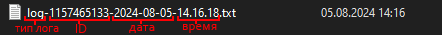
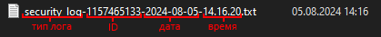
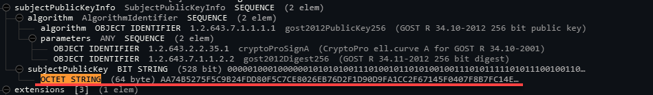
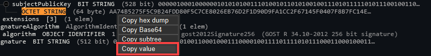
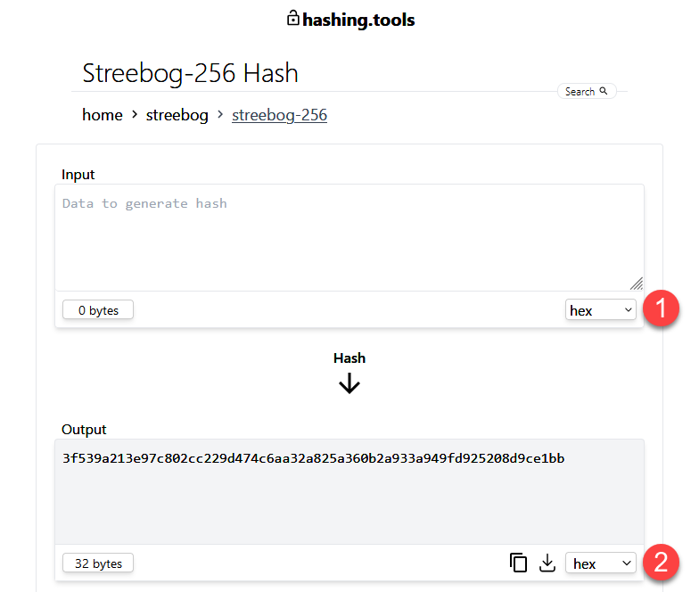
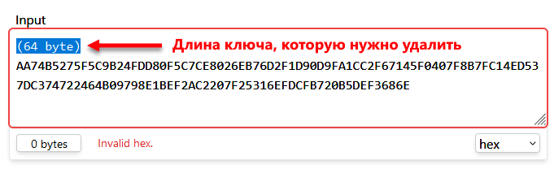
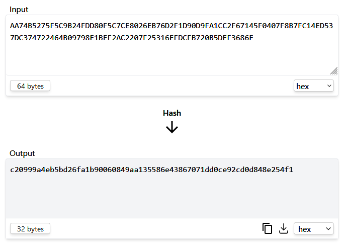
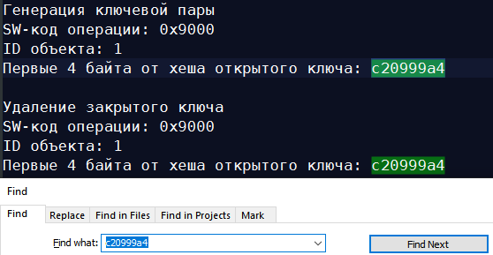

:toc:

== Общая информация

*Утилита Диагностики Рутокен* (УДР) предназначена для проверки работы
устройств Рутокен. Она позволяет получить полную информацию о работе
устройства и его параметрах. На некоторых устройствах также можно
выгрузить журнал событий безопасности с информацией об операциях,
совершенных на Рутокене.

Утилита реализована в виде консольного приложения, которое необходимо
загрузить на компьютер и сохранить в отдельной папке. После запуска
утилиты в ее папке появится папка `+logs+`, в которой будут создаваться
лог-файлы в формате TXT.

Количество проверок зависит от модели устройства Рутокен и версии
микропрограммы (МП). Все проверки и их наличие для разных моделей
Рутокенов описаны в Приложении 1.

=== Поддерживаемые ОС

Утилита работает в следующих операционных системах (ОС):

* Windows 7 и выше;
* macOS 10.15 и выше;
* DEB-based дистрибутивы Linux:
** Ubuntu 18 и выше;
** Debian 10 и выше;
** Astra Linux 1.7, 1.8.
* RPM-based дистрибутивы Linux: +
** Centos 7, 8;
** ROSA Linux 7.3 и выше;
** РЕД ОС 7.3, 8;
** Alter OS.
* ALT Linux 8, 9, 10.

=== Поддерживаемые устройства

При помощи утилиты можно проверить работу следующих устройств:

* Рутокен TLS;
* линейка Рутокен Lite;
* линейка Рутокен ЭЦП 2.0;
* линейка Рутокен ЭЦП 3.0: +
** Рутокен ЭЦП 3.0 3220;
** Рутокен ЭЦП 3.0 NFC 3100;
** Рутокен ЭЦП 3.0 3120.

Журнал событий безопасности доступен на следующих устройствах:

* Рутокен ЭЦП 3.0 3120.

== Работа с утилитой

. Загрузите утилиту на компьютер и сохраните ее в отдельной папке.
. Подключите Рутокен к компьютеру.

[WARNING]
====
К компьютеру должно быть подключено только одно устройство Рутокен,
иначе произвести диагностику не удастся.

====

. В зависимости от ОС компьютера, к которому подключено устройство,
выполните следующие действия:
+
.На ОС Windows:
[%collapsible]
====
.. Дважды щелкните по файлу *rutoken-diagnostic-tool.exe*. Откроется
консоль и запустится проверка подключенного устройства.
.. Дождитесь окончания диагностики.
====
+
.На ОС Linux:
[%collapsible]
====
.. Откройте папку с утилитой.
.. Щелкните правой кнопкой мыши в окне папки и выберите пункт *Открыть в
терминале*.
.. Выполните команду:

....
./rutoken-diagnostic-tool
....
.. Дождитесь окончания диагностики.
====
+
.На macOS:
[%collapsible]
====
.. Откройте папку с утилитой.
.. Щелкните правой кнопкой мыши по названию файла
*rutoken-diagnostic-tool*.
.. Выберите пункт *Свойства.*
.. В разделе *Открывать в приложении* выберите *Терминал (по
умолчанию)*.
.. Дважды щелкните по названию файла *rutoken-diagnostic-tool*.
.. Дождитесь окончания диагностики. 
====

. Если работа утилиты завершилась с ошибкой, найдите текст ошибки в
таблице ниже, устраните проблему и снова запустите утилиту.
. Если в консоли отобразилось сообщение «Процесс завершен», то
диагностика прошла успешно. Чтобы ознакомиться с ее результатами,
откройте сохраненный лог-файл.

[WARNING]
====
*Диагностика внешних пользователей*

Если диагностика проводилась на компьютере внешнего пользователя, после
окончания работы удалите УДР, лог-файлы и файлы журнала событий
безопасности.
====

=== Ошибки диагностики

[cols=",,",]
|===
|Текст ошибки |Описание |Решение

|Не удалось произвести +
проверку. Проверьте чтобы +
к компьютеру был подключен +
только один Рутокен |К компьютеру подключено несколько устройств Рутокен
|Отключите все устройства Рутокен +
кроме того, которое нужно диагностировать, +
и запустите утилиту снова

|Не удалось сохранить +
Лог-файл |У утилиты диагностики нет прав на запись файлов в директорию
a|
Убедитесь, что у вас есть права на создание файлов +
и папок в директории, в которой находится утилита.

*На ОС Windows:*

. Щелкните правой кнопкой мыши +
по папке с утилитой.
. Откройте *Свойства (Properties)*.
. Перейдите на вкладку *Безопасность (Security)*.
. Нажмите *Изменить... (Edit...)*.
. В столбце **Разрешить (Allow)  +
**поставьте галочку напротив  +
*Полный доступ (Full control)*.
. Нажмите *ОК*.

*На ОС Linux:*

. Откройте терминал в папке с утилитой.
. Дайте пользовательской учетной записи права +
на чтение и запись в директорию с утилитой: +
`+sudo chmod -R u+rw ./+`

*На macOS:*

. Щелкните правой кнопкой мыши +
по папке с утилитой.
. Выберите пункт *Свойства.*
. В разделе *Общий доступ и права доступа* +
для своей учетной записи выберите *Чтение +
и запись*

a|
[red]#some pcsc error acquired: 31(0x0000001f)#

[red]#some pcsc error acquired: -2146435050(0x80100016)#

|Утилита потеряла связь с устройством +
в процессе диагностики |Отключите Рутокен от компьютера, +
подключите снова и перезапустите утилиту

|Не удалось распознать Рутокен |К компьютеру подключено устройство
Рутокен, но утилита не может его опознать a|
Если ошибка возникла при попытке диагностировать:

* USB-токен — подключите его к другому USB-разъему.
* Смарт-карту без поддержки NFC — убедитесь, что смарт-карта вставлена в
считыватель правильной стороной.
* Смарт-карту с поддержкой NFC с помощью бесконтактного считывателя —
перед запуском утилиты убедитесь, что смарт-карта приложена к
считывателю. Не убирайте смарт-карту, пока утилита не закончит
диагностику
|=== 

== Лог-файл диагностики

*Лог-файл диагностики* — это файл, в котором содержатся базовые сведения
об устройстве и его состоянии, а также информация о проведенных в ходе
диагностики проверках и их результатах. Данные из лог-файла диагностики
используются для оценки работоспособности устройства.

=== Параметры лог-файла диагностики

* Сохраняется в папке `+logs+` в той же директории, где находится
утилита `+rutoken-diagnostic-tool+`*.*
* Сохраняется в формате TXT, кодировка UTF-8.
* В конце каждой строки лог-файла используется символ LF (Line Feed).
* Название лог-файла состоит из: префикса `+log+`, ID Рутокена, даты и
времени его диагностики.

[NOTE]
====
*Пример лог-файла диагностики*
[.confluence-embedded-file-wrapper .confluence-embedded-manual-size]##
====

=== Содержание лог-файла диагностики

Количество разделов и информация в них могут меняться в зависимости от
того, какие проверки может пройти устройство. Полный список этих
проверок находится в Приложении 1.

[width="100%",cols="30%,70%",]
|===
|Раздел |Содержание

|Проверка целостности ОС устройства a|
Контрольная сумма ОС Рутокен, которая вычисляется в ходе проверки, +
и итог сравнения ее значения с эталонным

[WARNING]
====

Если в результате данной проверки отобразилась ошибка, то результаты
остальных проверок могут быть недостоверными, поэтому мы не рекомендуем
их использовать.
====

|Получение кратких сведений об устройстве a|
Информация о подключенном Рутокене:

* модель;
* ID;
* сеансовый счетчик изменений в файловой структуре устройства;
* счетчик подключений к USB-шине;
* версия микропрограммы;
* размер занятой EEPROM-памяти;
* размер свободной EEPROM-памяти

|Проверка работы криптоалгоритмов a|
Информация о работе криптоалгоритмов:

* ГОСТ 28147-89;
* ГОСТ 34.10-2001;
* ГОСТ 34.11-1994;
* ВКО 2001;
* ГОСТ 34.10-2012;
* ГОСТ 34.11-2012;
* ВКО 2012;
* ГОСТ Р 34.12-2015 Магма;
* ГОСТ Р 34.12-2015 Кузнечик;
* ECDH

|Проверка целостности КИ a|
Информация о состоянии сохраненных на Рутокене объектов:

* главный ключ;
* ключ для ГСЧ;
* IV для ГСЧ;
* глобальные PIN-коды;
* RSF-файлы

|Получение журнала ошибочных операций |Значения счетчиков ошибочных
операций

|Получение статуса сектора памяти |Информация об использованной
встроенной EEPROM-памяти устройства по секторам

|Проверка работоспособности генератора случайных чисел (ГСЧ) |Информация
о состоянии ГСЧ

|Проверка поддержки журнала СБ a|
Информация о том, поддерживает ли устройство работу с журналом событий
безопасности.

Если устройство поддерживает журналирование, после этого раздела будет
приведен лог выгрузки журнала событий безопасности

|_Последняя строка лог-файла_ |Итог прохождения проверок
|===

=== Интерпретация результатов диагностики

==== Уровни критичности

В результате проверки рядом с каждым перечисленным ниже параметром
отображается уровень критичности. Этот уровень помогает оценить
работоспособность Рутокена.

В утилите реализовано два уровня критичности:

* *critical* — означает, что Рутокен можно использовать с ограничениями.
* *fatal* — означает, что Рутокен нельзя использовать. +

Уровень критичности оценивается с некоторыми ограничениями:

* не оцениваются числовые данные;
* не оцениваются ошибки, возникающие при получении информации.

Если проверка прошла успешно, уровень критичности не отображается.

Названия проверок и критичность их влияния на работоспособность Рутокена
представлены в таблице ниже. 

[width="99%",cols="<5%,<24%,<71%",options="header",]
|===
|№ |Название проверки |Влияние на работоспособность
|1 |Проверка целостности ОС Рутокен |[fatal]

|2 |Проверка работы криптоалгоритмов |[fatal] — если в результате
проверки работы всех криптоалгоритмов отобразились ошибки 

|2.1 |Тестирование алгоритма ГОСТ 28147-89 |[critical]

|2.2 |Тестирование алгоритма ГОСТ 34.10-2001 |[critical]

|2.3 |Тестирование алгоритма ГОСТ 34.11-1994 |[critical]

|2.4  |Тестирование алгоритма ВКО 2001 |[critical]

|2.5  |Тестирование алгоритма ГОСТ 34.10-2012 |[critical]

|2.6  |Тестирование алгоритма ГОСТ 34.11-2012 |[critical]

|2.7  |Тестирование алгоритма ВКО 2012 |[critical]

|2.8  |Тестирование алгоритма ГОСТ Р 34.12-2015 Магма |[critical]

|2.9  |Тестирование алгоритма ГОСТ Р 34.12-2015 Кузнечик |[critical]

|2.10  |Тестирование алгоритма ECDH |[critical]

|3  |Проверка целостности КИ a|
[critical]  — если в результате проверки целостности всей ключевой
информации отобразилась хотя бы одна ошибка рядом с параметром со
статусом [critical].

{empty}[fatal] — если в результате проверки целостности всей ключевой
информации отобразилась хотя бы одна ошибка рядом с параметром со
статусом [fatal]

|3.1  |Проверка системной ключевой информации a|
Если при проверке возникла ошибка, уровень критичности [fatal]
присваивается:

* главному ключу;
* ключу для ГСЧ:
* IV для ГСЧ.

В общем заключении проверки уровень [fatal] присваивается, если в
результате проверки хотя бы одного из параметров возникла ошибка со
статусом [fatal]

|3.2  |Проверка Глобальных PIN-кодов |[fatal] — если в результате
проверки глобальных PIN-кодов отобразилась ошибка рядом с параметром
Проверка целостности (Администратора/Пользователя)

|3.3  |Проверка RSF файлов a|
Если при проверке возникла ошибка, уровень критичности [critical]
присваивается:

* открытым ключам;
* закрытым ключам;
* симметричным ключам;
* локальным PIN-кодам.

Если проверяемые объекты отсутствуют на Рутокене, уровень критичности
[critical] присваивается:

* открытым ключам;
* закрытым ключам;
* симметричным ключам.

В общем заключении проверки уровень [fatal] присваивается, если:

* при проверке всех RSF файлов возникла ошибка;
* при проверке всех ключей не удалось обнаружить объекты

|4 |Получение статуса секторов памяти a|
[critical] — если есть хоть один сектор, который содержит недостоверное
число перезаписей.

[fatal] — если все сектора содержат недостоверное число перезаписей

|5 |Проверка работоспособности ГСЧ |[fatal]
|===

[[id-УтилитаДиагностикиРутокен.Руководствопоиспользованию-Статусы]]
==== Статусы

В лог-файле после каждого параметра диагностики отображаются статусы.
Описания значений этих статусов представлены в таблице.

[width="100%",cols="^47%,^53%",]
|===
|Условие |Вывод статуса
|*Проверки* |
|Проверка прошла успешно a|
....
-> Успешно
....

|Проверяемые файлы отсутствуют a|
....
-> ОБЪЕКТЫ НЕ ОБНАРУЖЕНЫ
....

|Проверка прошла с ошибкой a|
....
-> !ОШИБКА [код ошибки] - <текст ошибки>
....

_или_

....
[критичность ошибки] -> !ОШИБКА [код ошибки] - <текст ошибки>
....

|Рутокен не поддерживает проверку a|
....
Запрошенная функция не поддерживается 
....

|*Общее заключение (последняя строка лог-файла)* |
|Все проверки завершились успешно a|
....
Все проверки прошли успешно
....

|Хотя бы одна проверка завершилась с ошибкой a|
....
При диагностике были выявлены ошибки
....

|===

==== Лог выгрузки журнала событий безопасности 

Процесс выгрузки журнала СБ поэтапно записывается в лог-файле
диагностики. Если устройство не поддерживает журналирование или в ходе
выгрузки журнала СБ возникнет ошибка, запись об этом отобразится в
лог-файле.

[width="100%",cols="45%,55%",]
|===
|Этап выгрузки |Результат

a|
----
Проверка поддержки журнала СБ
----

a|
[width="100%",cols="100%",]
!===
\!ОШИБКА [<SW-код>] - <текст ошибки>
!===

Не удалось проверить, поддерживается ли журналирование на устройстве.

Процесс выгрузки прерывается

| a|
[width="100%",cols="100%",]
!===
-> Успешно 

Журнал СБ не поддерживается
!===

Устройство не поддерживает журналирование. Список устройств, которые
поддерживают журналирование, находится в разделе *Поддерживаемые
устройства*.

Процесс выгрузки прерывается

| a|
[width="100%",cols="100%",]
!===
-> Успешно

Журнал СБ поддерживается
!===

Устройство поддерживает журналирование. 

Утилита переходит к следующему этапу выгрузки

a|
....
Чтение журнала СБ
....

a|
[width="100%",cols="100%",]
!===
!ОШИБКА [<SW-код>] - <текст ошибки>
!===

Не удалось прочесть журнал или журналирование не поддерживается.

Процесс выгрузки прерывается

| a|
[width="100%",cols="100%",]
!===
-> Успешно
!===

Журнал удалось прочитать.

Утилита переходит к следующему этапу выгрузки

a|
....
Декодирование журнала СБ
....

a|
[width="100%",cols="100%",]
!===
\!ОШИБКА Возникли ошибки при декодировании журнала.
!===

В журнале нашлись поврежденные TLV-структуры.

Журнал СБ выгружается в бинарном формате

| a|
[width="100%",cols="100%",]
!===
\!ОШИБКА Возникли ошибки при декодировании некоторых записей.
!===

В журнале встретились неизвестные теги или возникли проблемы при
преобразовании известных тегов.

Журнал СБ выгружается, операции в нем записываются последовательно два
раза:

* Записи, которые удалось преобразовать из бинарного формата в
человекочитаемый, записываются в человекочитаемом формате. Остальные
остаются в бинарном формате.
* Все теги записываются в бинарном формате. Раздел имеет заголовок:
«Журнал СБ в бинарном формате»

| a|
[width="100%",cols="100%",]
!===
-> Успешно
!===

Журнал был полностью декодирован.

Утилита переходит к следующему этапу выгрузки

a|
....
Запись журнала СБ в файл
....

a|
[width="100%",cols="100%",]
!===
\!ОШИБКА

Не удалось создать файл / Не удалось записать в файл
!===

Чтение и декодирование журнала прошло успешно, но возникла ошибка при
выгрузке журнала в файл.

Журнал СБ не выгружается

| a|
[width="100%",cols="100%",]
!===
-> Успешно

Файл security_log-<ID>-<дата>-<время>.txt создан
!===

Журнал успешно выгрузился в файл.

Утилита переходит к следующему этапу выгрузки

a|
....
Расчет SHA256 файла журнала СБ
....

a|
[width="100%",cols="100%",]
!===
-> Успешно

SHA256 файла журнала СБ: <хеш-код>
!===

Утилита успешно вычислила хеш-код файла журнала по алгоритму SHA256.

Выгрузка журнала завершена

|===

== Журнал событий безопасности
[NOTE]
====
Журнал событий безопасности поддерживается только на устройствах Рутокен
ЭЦП 3.0 3120.
====

*Журнал событий безопасности* — это функциональность УДР, записывающая
операции, происходящие на Рутокене. Данная функциональность требуется
для расследования инцидентов. На Рутокене журнал хранится в бинарном
формате в режиме «только для чтения». После завершения диагностики УДР
автоматически выгружает журнал в человекочитаемом формате на компьютер,
к которому подключен Рутокен. 

События в журнале не удаляются в результате форматирования. +

=== Параметры лог-файла журнала СБ

* Сохраняется в папке `+logs+` в той же директории, где находится
утилита `+rutoken-diagnostic-tool`.
* Создается одновременно с лог-файлом диагностики, но сохраняется в
отдельный лог-файл.
* Сохраняется в формате TXT, кодировка UTF-8.
* В конце каждой строки журнала используется символ LF (Line Feed).
* Название лог-файла журнала состоит из: префикса `+security_log+`, ID
Рутокена, даты и времени его диагностики.

[NOTE]
====
*Пример лог-файла журнала событий безопасности*

====

=== Содержание лог-файла журнала СБ

Если после окончания диагностики лог-файл журнала СБ не появился в папке
`logs`, выгрузился в бинарном формате или в нем не хватает информации,
проверьте, есть ли в лог-файле диагностики ошибки, связанные с
обработкой журнала. Подробнее об этих ошибках можно почитать в соответствующем
разделе.

Ниже приведен список операций, информация о которых записывается в
журнал СБ. В начало журнала записывается его версия, далее записываются
операции, относящиеся к этой версии. Если версий две и более, записи
выводятся в следующем формате:

* Первая версия журнала.
* Записи операций, относящиеся к первой версии журнала (если такие
операции были).
* Вторая версия журнала.
* Записи операций, относящиеся к первой версии журнала (если такие
операции были).
* и т.д.

Каждая запись об операции, кроме записи с версией журнала,
сопровождается кодом возврата (SW-кодом), который состоит из двух
частей. Код SW1 задает класс ошибки, а код SW2 позволяет
конкретизировать данную ошибку в пределах класса. Возможные значения
SW-кодов приведены в Приложении 2.

[width="86%",cols="7%,31%,62%",options="header",]
|===
|№ |Операция |Отображение 
|1 |Версия журнала a|
* Номер версии журнала

|2 |Импорт закрытого ключа a|
* Название операции,
* SW-код операции,
* ID объекта, 
* 4 первых байта от хеша открытого ключа (при наличии),
* «Операция не была завершена» (при необходимости)

|3 |Генерация ключевой пары a|
* Название операции,
* SW-код операции,
* ID объекта (при наличии),
* 4 первых байта от хеша открытого ключа (при наличии),
* «Операция не была завершена» (при необходимости)

|4 |Удаление закрытого ключа a|
* Название операции, 
* SW-код операции,
* ID объекта,
* 4 первых байта от хеша открытого ключа (при наличии),
* «Операция не была завершена» (при необходимости)

|5 |Генерация ключевой пары ФКН2 a|
* Название операции,
* SW-код операции,
* 4 первых байта от хеша имени контейнера (при наличии),
* 4 первых байта от хеша первого открытого ключа (при наличии),
* 4 первых байта от хеша второго открытого ключа (при наличии),
* «Операция не была завершена» (при необходимости)

|6 |Удаление контейнера ФКН2 a|
* Название операции, 
* SW-код операции,
* 4 первых байта от хеша имени контейнера (при наличии),
* 4 первых байта от хеша первого открытого ключа (при наличии),
* 4 первых байта от хеша второго открытого ключа (при наличии),
* «Операция не была завершена» (при необходимости)

|7 |Смена PIN Пользователя a|
* Название операции,
* SW-код операции,
* «Операция не была завершена» (при необходимости)

|8 |Импорт локального PIN a|
* Название операции, 
* SW-код операции,
* ID объекта,
* «Операция не была завершена» (при необходимости)

|9 |Разблокировка PIN-кода a|
* Название операции, 
* SW-код операции,
* Тип аутентификации (при наличии), +
* ID объекта (при наличии)

|10 |Неуспешная аутентификация a|
* Название операции, 
* SW-код операции,
* Тип аутентификации,
* ID объекта (при наличии),
* Количество оставшихся попыток аутентификации (при наличии)

|11 |Форматирование a|
* Название операции,
* SW-код операции

|===

=== Проверка целостности данных лог-файла журнала СБ

На устройстве Рутокен журнал СБ хранится в режиме «только для чтения»
(read only), однако после выгрузки полученный TXT-файл можно изменять.
Проверить, вносились ли в лог-файл журнала изменения, можно с помощью
сравнения хешей — хеш меняется, если изменяется содержимое файла. Для
этого:

. В лог-файле диагностики, который был создан одновременно с лог-файлом
журнала, найдите строку  *SHA256 файла журнала СБ* — это хеш лог-файла
журнала, который был автоматически вычислен УДР при его создании.
. Вычислите хеш текущей версии лог-файла журнала самостоятельно. Сделать
это можно, например, с помощью консольных утилит:
+
....
ОС Windows: certutil -hashfile "имя_файла_журнала_СБ.txt" sha256
....
+
....
ОС Linux: sha256sum "имя_файла_журнала_СБ.txt"
....
+
....
macOS: shasum -a 256 "имя_файла_журнала_СБ.txt"
....
. Сравните полученный хеш с хешем из лог-файла диагностики. Если хеш,
сгенерированный с помощью консольной утилиты, не совпадает с хешем в
лог-файле диагностики, значит, после выгрузки в файл журнала были
внесены изменения. 

=== Определение сертификата с удаленным ключом

Чтобы понять, для какого сертификата был удален ключ, вычислите хеш
открытого ключа, используя сертификат.

Чтобы вычислить хеш открытого ключа:

. Откройте онлайн-утилиту https://lapo.it/asn1js/[ASN.1 JavaScript
Decoder].
. Загрузите сертификат одним из двух способов:
* нажмите *Выберите файл* и выберите файл сертификата;
* перетащите сертификат на вкладку с утилитой.
. Найдите строку `+OCTET STRING+` в узле `+subjectPublicKey+`. +

. Нажмите на эту строку и выберите *Copy value*. +

. Перейдите на сайт https://hashing.tools/streebog/streebog-256.
. В выпадающем меню формата входных (1) и выходных (2) данных выберите
*hex*. +

. Вставьте скопированное значение в поле *Input* и удалите длину ключа,
а также перенос строки после нее. +
 +
Хеш высчитается автоматически, как только сайт обнаружит в поле *Input*
корректные данные. +

. Скопируйте первые 4 байта (8 символов) высчитанного хеша и найдите их
в журнале событий безопасности. +

include::./appendix1.adoc

include::./appendix2.adoc
